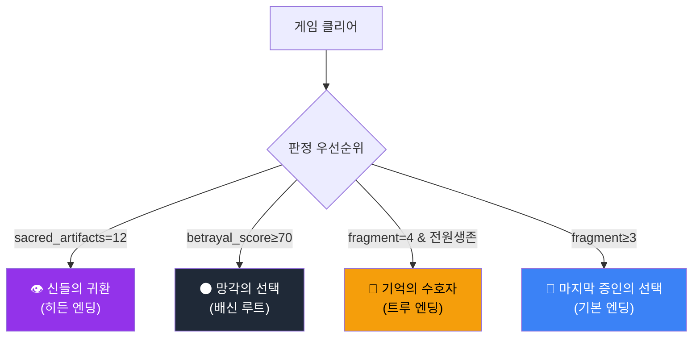
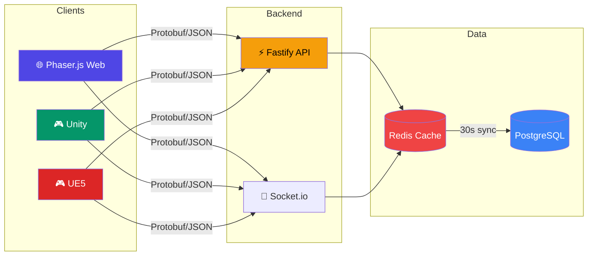

<div align="center">

# ⚔️ 에테르나 크로니클 (Aeterna Chronicle)

**기억은 사라져도, 이야기는 남는다.**

[](01_코어기획/P14_작업_리스트_v1.md)
[](#-기술-스택)
[](#-프로젝트-통계)
[](#-프로젝트-통계)
[](#-개발-현황)
[](#)

<br>

*실시간 반자동 전투 RPG — PC 웹 브라우저 + UE5 데스크톱 (콘솔 배포 제외)*

<br>

[📋 기획 문서](#-프로젝트-구조) · [🎮 핵심 시스템](#-핵심-시스템) · [🛠️ 기술 스택](#️-기술-스택) · [🚀 개발 현황](#-개발-현황) · [🔧 로컬 개발](#-로컬-개발)

</div>

---

## 🌍 세계관

> *대망각이 세계를 덮친 지 212년. 신들의 기억이 소멸하고, 에테르 결정만이 과거의 흔적을 품고 있다.*

플레이어는 **에리언** — 잊혀진 기억을 되살릴 수 있는 마지막 기억술사. 4개의 신성 기억 파편을 찾아 대륙을 횡단하며, 기억과 망각 사이에서 세계의 운명을 결정한다.

<details>
<summary><b>🗺️ 9개 지역 상세</b></summary>

<br>

| 지역 | 테마 | 특징 | 챕터 |
|------|------|------|------|
| 🌑 에레보스 | 망각의 폐허 | 칸텔라 사건, 기억 각성 | Ch.1 |
| 🌳 실반헤임 | 기억의 숲 | 엘프 영토, 첫 파편 | Ch.2 |
| 🏜️ 솔라리스 사막 | 불꽃의 땅 | 고대 유적, 이프리타 | Ch.3 |
| 🏰 아르겐티움 | 제국의 심장 | 황궁 잠입, 배신 | Ch.4 |
| 🏔️ 북방 영원빙원 | 얼어붙은 기억 | 기억석 사원 | Ch.4 |
| ⚓ 브리탈리아 | 자유항 | 무역 거점, 정보 허브 | Ch.3~4 |
| 💀 망각의 고원 | 최종 결전 | 레테와의 대결 | Ch.5 |
| 🌊 무한 안개해 | 봉인의 바다 | 시즌 2 안개해 던전 | Ch.6 |
| 🌀 기억의 심연 | 심해 심연 | 시즌 3 해저 던전 | Ch.7 |
| ⏳ 시간의 균열 | 왜곡된 시공간 | 시즌 4 시간 왜곡 던전 | Ch.8 |

</details>

---

## 🎮 핵심 시스템

<details>
<summary><b>⚔️ 클래스 시스템 (6종)</b></summary>

<br>

```
┌─────────────────────────────────────────────────────────┐
│                    에테르 기사                            │
│              ⚔️ 근접 탱커/딜러                           │
│     Lv.30 수호자 → Lv.50 파멸자 → Lv.80 에테르 폭주자   │
├─────────────────────────────────────────────────────────┤
│                     기억술사                              │
│              🔮 원거리 마법 딜러                          │
│   Lv.30 기억 직조사 → Lv.50 시간 조율사 → Lv.80 기억 지배자 │
├─────────────────────────────────────────────────────────┤
│                   그림자 직조사                            │
│              🗡️ 암살/서포터                              │
│    Lv.30 환영사 → Lv.50 영혼 수확자 → Lv.80 공허의 군주   │
├─────────────────────────────────────────────────────────┤
│                   기억 파괴자 ★ [Ch.6 해금]               │
│              💥 근접 딜러/디버퍼                          │
│   Lv.30 파편 수집자 → Lv.50 기억 침식자 → Lv.80 망각의 지배자│
├─────────────────────────────────────────────────────────┤
│                  시간 수호자 ★ [P11 신규]                 │
│              ⏳ 서포터/컨트롤러                           │
│  Lv.30 시간 관측자 → Lv.50 시간 조율자 → Lv.80 영원의 수호자│
└─────────────────────────────────────────────────────────┘
```

</details>

<details>
<summary><b>🎯 전투 시스템</b></summary>

<br>

- **실시간 반자동 전투** — 스킬 8슬롯 + 소비아이템 4슬롯
- **Active Pause** (`Space`) — 전술적 일시정지로 동료에게 직접 명령
- **기억 공명** — 에테르 결정 기반 특수 스킬 발동
- **장비** — 12 카테고리 (14 착용 포지션) / 6등급 (일반~신화)
- **에테르 소켓** — 장비에 에테르 결정 장착으로 커스텀 빌드

</details>

<details>
<summary><b>🌟 멀티 엔딩 (4+1종)</b></summary>

<br>



</details>

---

## 📁 프로젝트 구조

<details>
<summary><b>전체 디렉토리 트리 펼치기</b></summary>

<br>

```
에테르나크로니클/
├── 📋 00_인덱스/           # 시나리오·월드맵·캐릭터 인덱스
├── 📋 01_코어기획/         # 핵심 설계 문서 (21개)
│   ├── GDD_final.md            # 게임 디자인 문서 v2.2
│   ├── story_design.md         # 스토리 기획서 v1.1
│   ├── game_systems.md         # 게임 시스템 v1.1
│   ├── worldmap_design.md      # 월드맵 기획 v1.1
│   ├── 멀티엔딩_플래그_설계.md   # 엔딩 조건 SSOT
│   ├── 기술아키텍처_멀티엔진.md  # 기술 스택 v2.0
│   ├── monetization_design.md  # 수익화 모델
│   ├── qa_test_plan.md         # QA 전략
│   ├── sound_design.md         # 사운드 디자인
│   ├── npc_ai_design.md        # NPC AI 설계
│   ├── guild_system_design.md  # 길드 시스템
│   ├── pvp_balance_design.md   # PvP 밸런스
│   └── ...                     # +9 more
├── 🎨 02_UI_UX/            # UI/UX, BGM, 인트로 영상
├── 📊 03_데이터테이블/      # 전투·몬스터·아이템 밸런스
├── ✅ 04_검증_P0/
│   ├── P0/                     # 전투·엔딩·수직슬라이스 검증
│   ├── P1/                     # HUD포팅·QA·텔레메트리
│   └── P2/                     # 픽셀패리티·KPI·L10N
├── 📖 시나리오/
│   ├── 챕터/                   # 챕터 1~7 메인 시나리오
│   ├── NPC대화/                # 대화 스크립트 12개
│   └── 세계관외전/             # 발견 문서·이벤트
├── 🌍 월드맵/               # 8개 지역 상세 설계
├── 👤 캐릭터/               # 37파일: 30명 프로필 + 5 외전 + 마스터
├── 💻 client/               # Phaser.js 웹 클라이언트 (43 files)
│   ├── src/scenes/             # GameScene (Protobuf emit, 200ms 스로틀)
│   ├── src/ui/                 # HudOverlay (부분 렌더링)
│   ├── src/utils/              # ObjectPool 유틸
│   └── src/telemetry/          # NPC 대화 텔레메트리
├── 🖥️ server/               # Fastify + Prisma 서버 (176 files)
│   ├── src/db.ts               # Prisma 클라이언트
│   ├── src/redis.ts            # Redis (graceful degradation)
│   ├── src/socket/             # Room 기반 브로드캐스트 (Protobuf) — 34 핸들러
│   ├── src/routes/             # 55 라우트 (REST API)
│   ├── src/pvp/                # 매칭 큐 + ELO 아레나
│   ├── src/shop/               # P2W 가드
│   ├── src/ending/             # 엔딩 판정 엔진 + 플래그 추적
│   ├── src/apm/                # APM 메트릭 + 알림 + 대시보드
│   ├── src/telemetry/          # 이중 기록 (Redis + PostgreSQL)
│   └── prisma/schema.prisma    # 72 모델
├── 📦 shared/               # 클라이언트-서버 공유 코덱/타입 (3 files)
│   ├── proto/game.proto        # Protobuf 스키마 (PlayerMove/Action/Room)
│   ├── codec/gameCodec.ts      # 바이너리 인코더/디코더
│   └── types/telemetry.ts      # DialogueChoiceTelemetryEvent
├── 🎮 ue5_umg/              # UE5 HUD (C++ UMG)
├── 🎮 unity_ui_toolkit/     # Unity HUD (C# UI Toolkit, 19 files)
├── 🛡️ admin/               # 어드민 대시보드 (React + TailwindCSS, 18 files)
├── 📚 docs/                 # 구조 문서 + 에셋 파이프라인
│   ├── architecture/           # 아키텍처 문서 4개
│   ├── asset-pipeline/         # AI 에셋 파이프라인 문서 8개
│   └── art-production/        # 아트 프로덕션 문서 18개 (P13)
└── 🔧 tools/
    ├── art-pipeline/           # 에셋 후처리 자동화 (P13)
    ├── notion_sync/            # Obsidian → Notion 자동 동기화
    └── regression/             # 엔딩·SaveLoad·L10N 자동 테스트
```

</details>

---

## 🛠️ 기술 스택

<table>
<tr>
<td align="center" width="96">
<b>Phaser.js</b><br>
<sub>웹 클라이언트</sub>
</td>
<td align="center" width="96">
<b>Unity</b><br>
<sub>데스크톱/모바일</sub>
</td>
<td align="center" width="96">
<b>UE5</b><br>
<sub>고사양 PC</sub>
</td>
<td align="center" width="96">
<b>TypeScript</b><br>
<sub>클라이언트/서버</sub>
</td>
<td align="center" width="96">
<b>Node.js</b><br>
<sub>서버 런타임</sub>
</td>
<td align="center" width="96">
<b>Fastify</b><br>
<sub>REST API</sub>
</td>
</tr>
<tr>
<td align="center" width="96">
<b>PostgreSQL</b><br>
<sub>메인 DB</sub>
</td>
<td align="center" width="96">
<b>Redis</b><br>
<sub>캐시/세션</sub>
</td>
<td align="center" width="96">
<b>Prisma</b><br>
<sub>ORM (72 모델)</sub>
</td>
<td align="center" width="96">
<b>Socket.io</b><br>
<sub>실시간 통신</sub>
</td>
<td align="center" width="96">
<b>Docker</b><br>
<sub>컨테이너</sub>
</td>
<td align="center" width="96">
<b>Obsidian</b><br>
<sub>문서 관리</sub>
</td>
</tr>
</table>

### 아키텍처



---

## 🚀 개발 현황

### Phase 로드맵

```
Phase 0  ████████████████████  100%  코어 설계 + 세계관 + 시나리오
Phase 1  ████████████████████  100%  웹 프로토타입 + HUD + 챕터 1~2
Phase 2  ████████████████████  100%  멀티엔진 포팅 + 텔레메트리 + QA
Phase 3  ████████████████████  100%  길드/PvP/과금/UE5/k8s/CI — 18/20 RC
Phase 4  ████████████████████  100%  펫/제작/NPC/소셜/사운드/E2E — 20/20 RC
Phase 5  ████████████████████  100%  몬스터/스킬/던전/월드/L10N — 50/50 출시 RC
Phase 6  ████████████████████  100%  수익화/길드전/PvP정규화/프로덕션 — 60/60 오픈 베타 ✅
Phase 7  ████████████████████  100%  시스템 연동 완성 + 프로덕션 품질 — 128/128 GA ✅
Phase 8  ████████████████████  100%  시즌2 깨어나는 봉인 — 148/148 시즌2 출시 ✅
Phase 9  ████████████████████  100%  멀티 플랫폼 + 실서비스 — 168/168 GA 출시 🚀
Phase 10 ████████████████████  100%  웹 아키텍처 리팩터링 — 188/188 구조 개선 🏗️
Phase 11 ████████████████████  100%  시즌3 기억의 심연 + 비주얼 폴리싱 — 208/208 시즌3 출시 🌊
Phase 12 ████████████████████  100%  커뮤니티 + 기술부채 — 228/228 품질 개선 🔧
Phase 13 ████████████████████  100%  아트 프로덕션 파이프라인 — 248/248 생산 체계 🎨
Phase 14 ████████████████████  100%  데이터/ML + 시즌4 — 268/268 지능화 🧠
```

**15 Phase 완료 · 268 Notion 티켓 전부 Done · TODO/FIXME 0건**

### 정합성 검증 (2026-03-12)

```
누적 검증     118항목 검증 → 60건 수정 완료
─────────────────────────────────────────────
시나리오       14항목 → 치명 2 + 중요 5 수정
캐릭터         18항목 → 치명 2 + 중요 3 수정
월드맵         14항목 → 치명 6 + 중요 2 수정
전역 패치       25곳 / 11파일 — 대망각·파편·나이·NPC 통일
md 기획문서     10항목 → 8건 수정 (클래스 5종/던전 30개/챕터 7개/DB 72모델 현행화)
P9 GA검증      12항목 → 5건 수정 (Unity WebGL/Stripe/GDPR/보안감사/법적문서)
P10 구조검증    15항목 → 8건 수정 (DI컨테이너/기능토글/선언형라우트/ESLint/SSOT)
P11 시즌3검증   20항목 → 7건 수정 (시간수호자/심연던전/월드보스/코스메틱/에셋파이프라인)
```

### 📖 가이드 문서

| 문서 | 설명 |
|------|------|
| [🎮 플레이 가이드](01_코어기획/에테르나크로니클_플레이_가이드.md) | 클래스 선택, 전투, 챕터 공략, 던전, 제작, PvP, 멀티엔딩 — 747줄 완전 공략 |
| [🔧 설치 가이드](01_코어기획/에테르나크로니클_설치_가이드.md) | Quick Start, DB/Redis, Docker, k8s, CI/CD, 테스트 — 개발 환경 세팅 |

### 🏗️ Architecture

| 문서 | 설명 |
|------|------|
| [전체 구조 개요](docs/architecture/overview.md) | client/server/admin/shared 역할 분리 |
| [서버 부트스트랩](docs/architecture/server-bootstrap.md) | 4-모듈 분해 (compositionRoot → featureRegistry → runtimeServices → shutdown) |
| [공유 계약 계층](docs/architecture/shared-contracts.md) | proto/codec/DTO SSOT 사용법 |
| [기능 토글 가이드](docs/architecture/feature-flags.md) | 환경변수/런타임 기능 on/off (31개 토글) |

### 🎨 에셋 파이프라인

> P11에서 추가된 AI 에셋 생성·관리 파이프라인. `docs/asset-pipeline/` 하위 8개 문서.

| 문서 | 설명 |
|------|------|
| [파이프라인 개요](docs/asset-pipeline/overview.md) | AI 에셋 생성 워크플로우 전체 구조 |
| [BGM 디자인](docs/asset-pipeline/bgm-design.md) | 지역별 BGM 생성·편집 가이드 |
| [캐릭터 스프라이트](docs/asset-pipeline/character-sprites.md) | 캐릭터/NPC 스프라이트 생성 규격 |
| [아이콘 스펙](docs/asset-pipeline/icon-spec.md) | UI 아이콘 해상도·스타일 가이드 |
| [몬스터 아트 가이드](docs/asset-pipeline/monster-art-guide.md) | 몬스터 비주얼 디자인 기준 |
| [프롬프트 템플릿](docs/asset-pipeline/prompt-templates.md) | AI 생성용 프롬프트 표준 템플릿 |
| [SFX 카탈로그](docs/asset-pipeline/sfx-catalog.md) | 효과음 분류·명명 규칙 |
| [타일맵 스펙](docs/asset-pipeline/tilemap-spec.md) | 지역별 타일맵 규격·레이어 구조 |

### 🎨 아트 프로덕션 (P13 신규)

> P13에서 추가된 그래픽 생산 파이프라인. `docs/art-production/` 18개 문서 + `tools/art-pipeline/` 5개 스크립트.

| 문서 | 설명 |
|------|------|
| [스타일 가이드](docs/art-production/style-guide.md) | 비주얼 톤, 색상 팔레트 9지역, 라인/셰이딩 규칙 |
| [캐릭터 디자인](docs/art-production/character-design/overview.md) | 플레이어·동료 캐릭터 디자인 시트 |
| [NPC 디자인](docs/art-production/npc-design/overview.md) | NPC 비주얼 가이드 |
| [몬스터 디자인](docs/art-production/monster-design/overview.md) | 몬스터 비주얼 디자인 기준 |
| [보스 디자인](docs/art-production/boss-design/overview.md) | 보스 비주얼·페이즈별 연출 |
| [스프라이트 규격](docs/art-production/sprite-spec.md) | 8방향×7모션, 프레임 수, 시트 레이아웃 |
| [애니메이션 규격](docs/art-production/animation-spec.md) | 모션별 FPS, 프레임 수, 이징 |
| [타일맵 디자인](docs/art-production/tilemap-design/overview.md) | 지역별 타일맵 레이어·규격 |
| [배경 디자인](docs/art-production/background-design/overview.md) | 지역별 배경 아트 가이드 |
| [UI 스킨 디자인](docs/art-production/ui-skin-design.md) | HUD·메뉴·팝업 스킨 규격 |
| [아이콘 디자인](docs/art-production/icon-design/overview.md) | 아이템·스킬·UI 아이콘 가이드 |
| [VFX 디자인](docs/art-production/vfx-design/overview.md) | 스킬·환경 이펙트 규격 |
| [코스메틱 디자인](docs/art-production/cosmetic-design/overview.md) | 시즌별 코스메틱 비주얼 기준 |
| [컷씬 스토리보드](docs/art-production/cutscene-storyboard/overview.md) | 챕터별 컷씬 연출 보드 |
| [AI 마스터 프롬프트](docs/art-production/ai-prompt-master.md) | SD/DALL-E/MJ 카테고리별 프롬프트 + LoRA/ControlNet |
| [에셋 버전 관리](docs/art-production/asset-versioning.md) | Git LFS, 네이밍, 폴더 구조, 브랜치 전략 |
| [생산 일정](docs/art-production/production-schedule.md) | 1,248 에셋 우선순위 매트릭스, MVP 12주 로드맵 |
| [QA 체크리스트](docs/art-production/qa-checklist.md) | 자동+수동 품질 검증 기준 |

| 도구 | 설명 |
|------|------|
| [후처리 파이프라인](tools/art-pipeline/README.md) | 배경제거→색보정→QA→시트조립 자동화 |

### 최근 업데이트

> **2026-03-12** — **Phase 14 데이터/ML + 시즌 4 완료** (20/20, 268/268). ClickHouse 웨어하우스 + 이벤트 수집 SDK + 이탈 예측 + 추천 시스템 + 밸런스 자동 조정 + A/B 테스트 + 실시간 운영 대시보드 (CCU/매출/이탈/추천CTR) + Grafana 임베드 + 이상 탐지 v2 (Isolation Forest/골드 세탁 그래프/Win-Trading) + 챕터 8 "시간의 균열" + 6번째 클래스 허공의 방랑자 + 시간의 균열 지역 + 시즌 4 시즌패스 + 8인 레이드 + 펫 진화 + PvP 시즌 3 + Lv.100 캡 + 몬스터 30종 + 던전 5개 + 월드 이벤트 3종 → **데이터 기반 운영 자동화 + 시즌 4 콘텐츠 완비** 🧠

> **2026-03-12** — **Phase 13 아트 프로덕션 파이프라인 완료** (20/20, 248/248). 아트 스타일 가이드 + 캐릭터/NPC/몬스터/보스 디자인 시트 + 타일맵/배경/UI/아이콘/이펙트/코스메틱/컷씬 기획 + AI 마스터 프롬프트 (SD/DALL-E/MJ) + 후처리 파이프라인 5개 스크립트 + QA 체크리스트 + 에셋 버전 관리 + 생산 일정 (1,248 에셋, MVP 363) → **생산 체계 완비** 🎨

> **2026-03-12** — **Phase 12 커뮤니티 + 기술부채 완료** (20/20, 228/228). 커뮤니티 시스템 + 기술부채 해소 → **품질 개선 완료** 🔧

> **2026-03-12** — **Phase 11 시즌 3 "기억의 심연" 완료** (20/20, 208/208). 챕터 7 + 시간 수호자 + 무한 던전 + 월드 보스 + AI 에셋 파이프라인 + 코스메틱 50개 + 몬스터 30종 + 던전 5개 + 엔딩D 유물 12개 문서화 + 기억파괴자 게이트 구현 → **시즌 3 출시** 🌊

> **2026-03-12** — **Phase 10 웹 아키텍처 리팩터링 완료** (20/20, 188/188). server.ts 350줄→16줄 분해 + ServiceContainer DI + 기능토글 20개 + 선언형 라우트 매니페스트 + shared SSOT + 구조문서 4건 + 테스트 7건 신규 + ESLint 통일 + TODO 0건 → **구조 개선 완료** 🏗️

> **2026-03-12** — **Phase 9 GA 출시 승인** (20/20, 168/168). Unity WebGL 클라이언트 + Stripe 실결제 + 안티치트/어뷰징 탐지 + GDPR + 계정보안(2FA) + 법적문서 6종 + 고객지원 + 크로스 클라이언트 검증 + OWASP 보안감사 v2 + 통합 테스트 → **실서비스 GA 출시** 🚀

> **2026-03-12** — **Phase 8 시즌 2 출시 RC PASS** (20/20, 148/148). PvP 시즌2 (맵 2개+보상+강등) + 길드 레이드/하우스 + NPC 10명 + L10N 3언어 + E2E 통합 테스트 → 시즌 2 "깨어나는 봉인" 출시 승인

> **2026-03-12** — **Phase 7 GA 판정 PASS** (20/20, 128/128). APM(Sentry/Datadog) + 구조화 로그(Loki/Grafana) + CDN + DB 백업 + OWASP 보안감사 + OpenAPI 문서화 + 통합 RC 완료 → 정식 출시 준비 완료
>
> **2026-03-12** — **플레이 가이드 & 설치 가이드** 추가. 정합성 전역 패치 완료 (시나리오·캐릭터·월드맵 46항목 검증, 25곳 수정)
>
> **2026-03-11** — **Phase 6 오픈 베타 승인** (20/20, 60/60 PASS). 수익화·전투 고도화·소셜·프로덕션 배포 전부 구현

<details>
<summary><b>📋 코어기획 문서 (21개)</b></summary>

<br>

| 분류 | 문서 | 버전 | 설명 |
|------|------|------|------|
| 🎯 핵심 | GDD_final.md | v2.2 | 게임 디자인 문서 (통합 참조) |
| 🎯 핵심 | story_design.md | v1.1 | 스토리·세계관·캐릭터 |
| 🎯 핵심 | game_systems.md | v1.1 | 클래스·전투·아이템·경제 |
| 🎯 핵심 | worldmap_design.md | v1.1 | 8개 지역 설계 |
| 🎯 핵심 | 멀티엔딩_플래그_설계.md | v1.0 | 엔딩 조건 SSOT |
| 🔧 기술 | 기술아키텍처_멀티엔진.md | v2.0 | 멀티엔진 아키텍처 (정본) |
| 🔧 기술 | tech_architecture.md | v1.0 | 웹 전용 (아카이브) |
| 💰 비즈 | monetization_design.md | v1.0 | P2W 제로 수익화 모델 |
| 🧪 QA | qa_test_plan.md | v1.0 | 테스트 피라미드·릴리즈 게이트 |
| 🎵 오디오 | sound_design.md | v1.0 | 지역별 BGM·SFX·인터랙티브 |
| 🌐 L10N | localization_strategy.md | v1.0 | ko/en/ja/zh 로컬라이제이션 |
| 🐾 시스템 | pet_system_design.md | v1.0 | 펫 획득·성장·전투 |
| ⚒️ 시스템 | crafting_system_design.md | v1.0 | 에테르 결정 제작 |
| 🤖 AI | npc_ai_design.md | v1.0 | FSM/BT 몬스터·보스 AI |
| 🏰 소셜 | guild_system_design.md | v1.0 | 길드 생성·전쟁·레이드 |
| ⚔️ PvP | pvp_balance_design.md | v1.0 | 아레나·정규화·시즌 |
| ♿ 접근성 | accessibility_design.md | v1.0 | WCAG 2.1 AA 준수 |
| 🔑 운영 | admin_tools_design.md | v1.0 | GM 도구·밴·대시보드 |
| 💬 소셜 | social_system_design.md | v1.0 | 친구·차단·신고·우편 |
| 📋 관리 | 작업 티켓 보드 리스트 | v1.0 | Phase 2 작업 보드 |
| 🐛 관리 | 이슈_트래커.md | — | 이슈 추적 |

</details>

---

## 📋 설계 원칙

| 원칙 | 설명 |
|------|------|
| 📌 **SSOT** | 각 설계 요소의 정본 문서를 1개만 지정 |
| 🚫 **P2W 제로** | 코스메틱/편의 과금만 — 스탯 직접 판매 금지 |
| ♿ **WCAG 2.1 AA** | 색맹 모드, 키보드 전용, 난이도 조절 |
| 🤖 **자동화 우선** | 엔딩 회귀 · SaveLoad · L10N 자동 검증 |
| 🔄 **Obsidian ↔ Notion** | 양방향 문서 동기화 파이프라인 |

---

## 🔧 로컬 개발

<details>
<summary><b>웹 클라이언트</b></summary>

```bash
cd client
npm install
npm run dev
# → http://localhost:5173
```

</details>

<details>
<summary><b>서버</b></summary>

```bash
cd server
npm install
npx prisma generate
npm run dev
# → http://localhost:3000
```

</details>

<details>
<summary><b>자동화 도구</b></summary>

```bash
# Obsidian → Notion 동기화
python3 tools/notion_sync/sync_runner.py --mode incremental

# 회귀 테스트
python3 tools/regression/ending_regression_runner.py
python3 tools/regression/saveload_integrity_runner.py
python3 tools/regression/l10n_key_integrity_runner.py
```

</details>

---

## 📊 프로젝트 통계

| 항목 | 수치 |
|------|------|
| 총 커밋 | 124개+ |
| Notion 티켓 | 268개 (전부 Done) |
| 기획 문서 | 720개+ (.md) |
| 코어기획 | 21개 |
| 캐릭터 | 47개 (프로필 40 + 외전 5 + 마스터 1 + 인덱스 1) |
| 시나리오 | 24개 (챕터 7 + NPC대화 12 + 세계관외전 2 + 마스터 3) |
| 월드맵 | 10개 (8지역 + 마스터 2) |
| 지역 | 9개 (45개 존) — 시즌4 시간의 균열 포함 |
| 챕터 | 8개 |
| 시즌 | 4개 (대망각의 잔향 / 깨어나는 봉인 / 심연의 메아리 / 균열의 메아리) |
| 엔딩 | 4+1종 (히든 엔딩D 유물 12개 문서화 완료) |
| 클래스 | 6종 (에테르 기사/기억술사/그림자 직조사/기억 파괴자/시간 수호자/허공의 방랑자) |
| 스킬 | 180개 (6클래스 × 30) |
| 던전 | 35개 (기본20+안개해5+심연5+시간균열5) × 3난이도 |
| 몬스터 | 197종 (일반 120/엘리트 35/보스 27/필드보스 5/레이드 6 + 균열보스 4) |
| 코스메틱 | 200개 (시즌1 50 + 시즌2 50 + 시즌3 50 + 시즌4 50) |
| 검증 리포트 | 55개+ (P0~P11) |
| 서버 | Fastify + Socket.io + Prisma (192 files) |
| 클라이언트 | Phaser.js + TypeScript (43 files) |
| Unity | C# UI Toolkit (19 files) |
| 어드민 | React + TailwindCSS (18 files) |
| 테스트 | 46 files |
| DB 모델 | 78개 (Prisma) |
| API 라우트 | 61개 REST (6개 대시보드 API 추가) |
| 소켓 핸들러 | 34개 |
| 기능 토글 | 31개 |
| CI 워크플로우 | 8개 |
| TODO/FIXME | 0건 |
| 공유 코덱/타입 | Protobuf + TypeScript (3 files) |
| 통신 프로토콜 | Protobuf 바이너리 (고빈도) + JSON (저빈도) |
| i18n | 한/영/일 3언어 (시즌3 키 포함) |
| 수익화 | 시즌 패스 50단계 × 4시즌 + IAP 6종 + 코스메틱 200개 (P2W 제로) |
| PvP 맵 | 5개 (기본 1 + 시즌2: 안개해 아레나, 심해 콜로세움 + 시즌3: 시간 왜곡 투기장, 균열 전장) |
| 레이드 보스 | 5종 (8~12인 레이드) |
| 하우징 | 개인 + 길드 하우스, 가구 50종 |
| 이벤트 | 13종 (로그인 2 + 더블 2 + 챌린지 2 + 토벌 2 + PvP 2 + 시간균열 3) |
| 정합성 검증 | 126항목 검증, 68건 수정 완료 |
| ML/분석 | ClickHouse 웨어하우스 + 이벤트SDK + 이탈예측 + 추천 + 밸런스자동 + A/B + 이상탐지v2 |
| 인프라 | k8s 20매니페스트 + Docker + CI/CD 8워크플로우 + 프로덕션 블루/그린 |

---

<div align="center">

### 🤝 기여

이 프로젝트는 현재 공개되어 있습니다.

---

<sub>Built with ⚔️ and ☕ — 기억과 망각의 경계에서</sub>

<br>

[](https://github.com/crisious)

</div>
