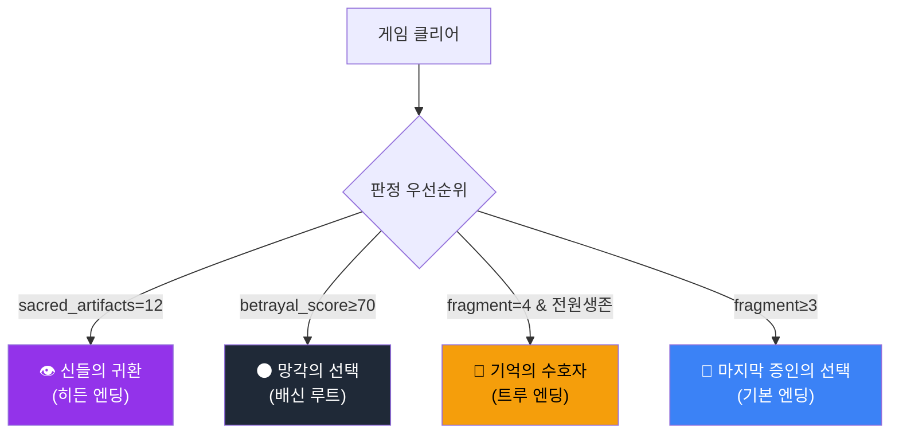
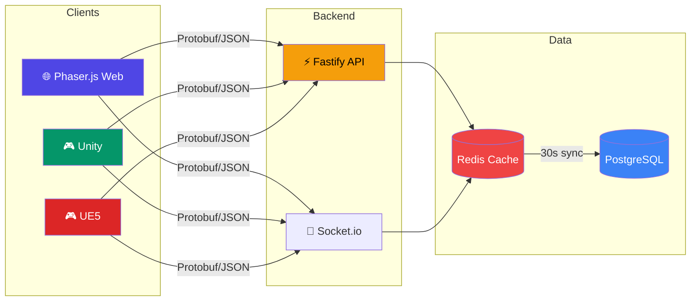

<div align="center">

# ⚔️ 에테르나 크로니클 (Aeterna Chronicle)

**기억은 사라져도, 이야기는 남는다.**

[](01_코어기획/P3_작업_리스트_v1.md)
[](#-기술-스택)
[](#-코어기획-문서-21개)
[](#)

<br>

*실시간 반자동 전투 RPG — PC 웹 브라우저 + UE5 데스크톱 (콘솔 배포 제외)*

<br>

[📋 기획 문서](#-프로젝트-구조) · [🎮 핵심 시스템](#-핵심-시스템) · [🛠️ 기술 스택](#️-기술-스택) · [🚀 개발 현황](#-개발-현황) · [🔧 로컬 개발](#-로컬-개발)

</div>

---

## 🌍 세계관

> *대망각이 세계를 덮친 지 212년. 신들의 기억이 소멸하고, 에테르 결정만이 과거의 흔적을 품고 있다.*

플레이어는 **에리언** — 잊혀진 기억을 되살릴 수 있는 마지막 기억술사. 4개의 신성 기억 파편을 찾아 대륙을 횡단하며, 기억과 망각 사이에서 세계의 운명을 결정한다.

<details>
<summary><b>🗺️ 6개 지역 상세</b></summary>

<br>

| 지역 | 테마 | 특징 | 챕터 |
|------|------|------|------|
| 🏰 아르겐티움 | 제국의 심장 | 시작 도시, 정치적 음모 | Ch.1 |
| 🌳 실반헤임 | 기억의 숲 | 엘프 영토, 세계수 | Ch.2 |
| 🏜️ 솔라리스 사막 | 불꽃의 땅 | 고대 유적, 화염 부족 | Ch.3 |
| 🏔️ 북방 영원빙원 | 얼어붙은 기억 | 기억석 사원 | Ch.4 |
| ⚓ 브리탈리아 | 자유항 | 무역 거점, 정보 허브 | Ch.4~5 |
| 🌑 에레보스 | 망각의 폐허 | 최종 던전, 망각의 핵심 | Ch.5 |

</details>

---

## 🎮 핵심 시스템

<details>
<summary><b>⚔️ 클래스 시스템 (3종)</b></summary>

<br>

```
┌─────────────────────────────────────────────────────────┐
│                    에테르 기사                            │
│              ⚔️ 근접 탱커/딜러                           │
│     Lv.30 수호자 → Lv.50 파멸자 → Lv.80 에테르 폭주자   │
├─────────────────────────────────────────────────────────┤
│                     기억술사                              │
│              🔮 원거리 마법 딜러                          │
│   Lv.30 기억 직조사 → Lv.50 시간 조율사 → Lv.80 기억 지배자 │
├─────────────────────────────────────────────────────────┤
│                   그림자 직조사                            │
│              🗡️ 암살/서포터                              │
│    Lv.30 환영사 → Lv.50 영혼 수확자 → Lv.80 공허의 군주   │
└─────────────────────────────────────────────────────────┘
```

</details>

<details>
<summary><b>🎯 전투 시스템</b></summary>

<br>

- **실시간 반자동 전투** — 스킬 8슬롯 + 소비아이템 4슬롯
- **Active Pause** (`Space`) — 전술적 일시정지로 동료에게 직접 명령
- **기억 공명** — 에테르 결정 기반 특수 스킬 발동
- **장비** — 12 카테고리 (14 착용 포지션) / 6등급 (일반~신화)
- **에테르 소켓** — 장비에 에테르 결정 장착으로 커스텀 빌드

</details>

<details>
<summary><b>🌟 멀티 엔딩 (4종)</b></summary>

<br>



</details>

---

## 📁 프로젝트 구조

<details>
<summary><b>전체 디렉토리 트리 펼치기</b></summary>

<br>

```
에테르나크로니클/
├── 📋 00_인덱스/           # 시나리오·월드맵·캐릭터 인덱스
├── 📋 01_코어기획/         # 핵심 설계 문서 (21개)
│   ├── GDD_final.md            # 게임 디자인 문서 v2.2
│   ├── story_design.md         # 스토리 기획서 v1.1
│   ├── game_systems.md         # 게임 시스템 v1.1
│   ├── worldmap_design.md      # 월드맵 기획 v1.1
│   ├── 멀티엔딩_플래그_설계.md   # 엔딩 조건 SSOT
│   ├── 기술아키텍처_멀티엔진.md  # 기술 스택 v2.0
│   ├── monetization_design.md  # 수익화 모델
│   ├── qa_test_plan.md         # QA 전략
│   ├── sound_design.md         # 사운드 디자인
│   ├── npc_ai_design.md        # NPC AI 설계
│   ├── guild_system_design.md  # 길드 시스템
│   ├── pvp_balance_design.md   # PvP 밸런스
│   └── ...                     # +9 more
├── 🎨 02_UI_UX/            # UI/UX, BGM, 인트로 영상
├── 📊 03_데이터테이블/      # 전투·몬스터·아이템 밸런스
├── ✅ 04_검증_P0/
│   ├── P0/                     # 전투·엔딩·수직슬라이스 검증
│   ├── P1/                     # HUD포팅·QA·텔레메트리
│   └── P2/                     # 픽셀패리티·KPI·L10N
├── 📖 시나리오/
│   ├── 챕터/                   # 챕터 1~5 메인 시나리오
│   ├── NPC대화/                # 대화 스크립트 12개
│   └── 세계관외전/             # 발견 문서·이벤트
├── 🌍 월드맵/               # 6개 지역 상세 설계
├── 👤 캐릭터/               # 37파일: 30명 프로필 + 5 외전 + 마스터
├── 💻 client/               # Phaser.js 웹 클라이언트 (9 files)
│   ├── src/scenes/             # GameScene (Protobuf emit, 200ms 스로틀)
│   ├── src/ui/                 # HudOverlay (부분 렌더링)
│   ├── src/utils/              # ObjectPool 유틸
│   └── src/telemetry/          # NPC 대화 텔레메트리
├── 🖥️ server/               # Fastify + Prisma 서버 (24 files)
│   ├── src/db.ts               # Prisma 클라이언트
│   ├── src/redis.ts            # Redis (graceful degradation)
│   ├── src/socket/             # Room 기반 브로드캐스트 (Protobuf)
│   ├── src/routes/             # 길드·PvP·상점·시즌패스·엔딩 REST API
│   ├── src/pvp/                # 매칭 큐 + ELO 아레나
│   ├── src/shop/               # P2W 가드
│   ├── src/ending/             # 엔딩 판정 엔진 + 플래그 추적
│   ├── src/apm/                # APM 메트릭 + 알림 + 대시보드
│   ├── src/telemetry/          # 이중 기록 (Redis + PostgreSQL)
│   └── prisma/schema.prisma    # 14모델
├── 📦 shared/               # 클라이언트-서버 공유 코덱/타입 (3 files)
│   ├── proto/game.proto        # Protobuf 스키마 (PlayerMove/Action/Room)
│   ├── codec/gameCodec.ts      # 바이너리 인코더/디코더
│   └── types/telemetry.ts      # DialogueChoiceTelemetryEvent
├── 🎮 ue5_umg/              # UE5 HUD (C++ UMG)
├── 🎮 unity_ui_toolkit/     # Unity HUD (C# UI Toolkit)
└── 🔧 tools/
    ├── notion_sync/            # Obsidian → Notion 자동 동기화
    └── regression/             # 엔딩·SaveLoad·L10N 자동 테스트
```

</details>

---

## 🛠️ 기술 스택

<table>
<tr>
<td align="center" width="96">
<b>Phaser.js</b><br>
<sub>웹 클라이언트</sub>
</td>
<td align="center" width="96">
<b>Unity</b><br>
<sub>데스크톱/모바일</sub>
</td>
<td align="center" width="96">
<b>UE5</b><br>
<sub>고사양 PC</sub>
</td>
<td align="center" width="96">
<b>TypeScript</b><br>
<sub>클라이언트/서버</sub>
</td>
<td align="center" width="96">
<b>Node.js</b><br>
<sub>서버 런타임</sub>
</td>
<td align="center" width="96">
<b>Fastify</b><br>
<sub>REST API</sub>
</td>
</tr>
<tr>
<td align="center" width="96">
<b>PostgreSQL</b><br>
<sub>메인 DB</sub>
</td>
<td align="center" width="96">
<b>Redis</b><br>
<sub>캐시/세션</sub>
</td>
<td align="center" width="96">
<b>Prisma</b><br>
<sub>ORM</sub>
</td>
<td align="center" width="96">
<b>Socket.io</b><br>
<sub>실시간 통신</sub>
</td>
<td align="center" width="96">
<b>Docker</b><br>
<sub>컨테이너</sub>
</td>
<td align="center" width="96">
<b>Obsidian</b><br>
<sub>문서 관리</sub>
</td>
</tr>
</table>

### 아키텍처



---

## 🚀 개발 현황

### Phase 로드맵

```
Phase 1  ████████████████████  100%  웹 프로토타입 + HUD + 챕터 1~2
Phase 2  ████████████████████  100%  멀티엔진 포팅 + 텔레메트리 + QA ✅ RC 승인
Phase 3  ████████████████████  100%  18/20 완료 ✅ RC 승인 (P3-04/05 라이브 후 검증)
Phase 4  ██████░░░░░░░░░░░░░░   30%  6/20 완료 — 펫/제작/NPC/소셜/사운드/퀘스트 (Sprint 3-4 진행 중)
```

### 최근 업데이트

> **2026-03-11** — Phase 4 진행 중 (6/20). 펫·제작·NPC AI·소셜·사운드·퀘스트 구현 완료. Sprint 3-4 착수

<details>
<summary><b>📋 코어기획 문서 (21개)</b></summary>

<br>

| 분류 | 문서 | 버전 | 설명 |
|------|------|------|------|
| 🎯 핵심 | GDD_final.md | v2.2 | 게임 디자인 문서 (통합 참조) |
| 🎯 핵심 | story_design.md | v1.1 | 스토리·세계관·캐릭터 |
| 🎯 핵심 | game_systems.md | v1.1 | 클래스·전투·아이템·경제 |
| 🎯 핵심 | worldmap_design.md | v1.1 | 6개 지역 설계 |
| 🎯 핵심 | 멀티엔딩_플래그_설계.md | v1.0 | 엔딩 조건 SSOT |
| 🔧 기술 | 기술아키텍처_멀티엔진.md | v2.0 | 멀티엔진 아키텍처 (정본) |
| 🔧 기술 | tech_architecture.md | v1.0 | 웹 전용 (아카이브) |
| 💰 비즈 | monetization_design.md | v1.0 | P2W 제로 수익화 모델 |
| 🧪 QA | qa_test_plan.md | v1.0 | 테스트 피라미드·릴리즈 게이트 |
| 🎵 오디오 | sound_design.md | v1.0 | 지역별 BGM·SFX·인터랙티브 |
| 🌐 L10N | localization_strategy.md | v1.0 | ko/en/ja/zh 로컬라이제이션 |
| 🐾 시스템 | pet_system_design.md | v1.0 | 펫 획득·성장·전투 |
| ⚒️ 시스템 | crafting_system_design.md | v1.0 | 에테르 결정 제작 |
| 🤖 AI | npc_ai_design.md | v1.0 | FSM/BT 몬스터·보스 AI |
| 🏰 소셜 | guild_system_design.md | v1.0 | 길드 생성·전쟁·레이드 |
| ⚔️ PvP | pvp_balance_design.md | v1.0 | 아레나·정규화·시즌 |
| ♿ 접근성 | accessibility_design.md | v1.0 | WCAG 2.1 AA 준수 |
| 🔑 운영 | admin_tools_design.md | v1.0 | GM 도구·밴·대시보드 |
| 💬 소셜 | social_system_design.md | v1.0 | 친구·차단·신고·우편 |
| 📋 관리 | 작업 티켓 보드 리스트 | v1.0 | Phase 2 작업 보드 |
| 🐛 관리 | 이슈_트래커.md | — | 이슈 추적 |

</details>

---

## 📋 설계 원칙

| 원칙 | 설명 |
|------|------|
| 📌 **SSOT** | 각 설계 요소의 정본 문서를 1개만 지정 |
| 🚫 **P2W 제로** | 코스메틱/편의 과금만 — 스탯 직접 판매 금지 |
| ♿ **WCAG 2.1 AA** | 색맹 모드, 키보드 전용, 난이도 조절 |
| 🤖 **자동화 우선** | 엔딩 회귀 · SaveLoad · L10N 자동 검증 |
| 🔄 **Obsidian ↔ Notion** | 양방향 문서 동기화 파이프라인 |

---

## 🔧 로컬 개발

<details>
<summary><b>웹 클라이언트</b></summary>

```bash
cd client
npm install
npm run dev
# → http://localhost:5173
```

</details>

<details>
<summary><b>서버</b></summary>

```bash
cd server
npm install
npx prisma generate
npm run dev
# → http://localhost:3000
```

</details>

<details>
<summary><b>자동화 도구</b></summary>

```bash
# Obsidian → Notion 동기화
python3 tools/notion_sync/sync_runner.py --mode incremental

# 회귀 테스트
python3 tools/regression/ending_regression_runner.py
python3 tools/regression/saveload_integrity_runner.py
python3 tools/regression/l10n_key_integrity_runner.py
```

</details>

---

## 📊 프로젝트 통계

| 항목 | 수치 |
|------|------|
| 총 파일 | 346개 (Git tracked) |
| 총 커밋 | 44개 |
| 기획 문서 | 153개 (.md) |
| 코어기획 | 21개 / ~12,000줄 |
| 캐릭터 | 37개 (프로필 30 + 외전 5 + 마스터 1 + 인덱스 1) |
| 시나리오 | 22개 (챕터 5 + NPC대화 12 + 세계관외전 2 + 마스터 3) |
| 월드맵 | 9개 (6지역 + 마스터 3) |
| 지역 | 6개 |
| 챕터 | 5개 |
| 엔딩 | 4종 |
| 검증 리포트 | 43개 (P0/P1/P2/공통) |
| 코드 파일 | 118개 (TS/C++/C#/Python) |
| 클라이언트 | Phaser.js + TypeScript (23 files) |
| 서버 | Fastify + Socket.io + Prisma (68 files) |
| UE5 | C++ GAS + UMG (40 files) |
| 인프라 | k8s 14매니페스트 + Docker + CI/CD 3워크플로우 |
| 공유 코덱/타입 | Protobuf + TypeScript (3 files) |
| 통신 프로토콜 | Protobuf 바이너리 (고빈도) + JSON (저빈도) |
| DB 모델 | 30개 (+Pet×2/Recipe/CraftLog/Npc/NpcAffinity/Friendship/Party/Mail/Quest/QuestProgress) |
| API 엔드포인트 | 40개+ REST + 20개+ Socket 이벤트 |

---

<div align="center">

### 🤝 기여

이 프로젝트는 현재 공개되어 있습니다.

---

<sub>Built with ⚔️ and ☕ — 기억과 망각의 경계에서</sub>

<br>

[](https://github.com/crisious)

</div>
