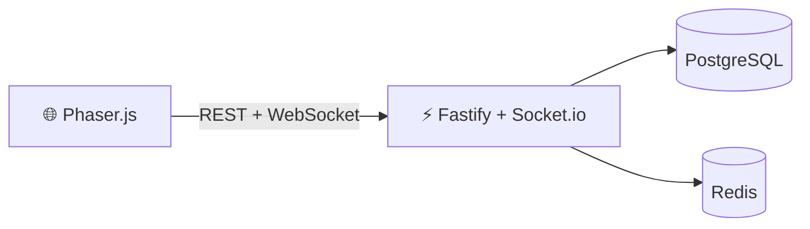

<div align="center">

# ⚔️ 에테르나 크로니클 (Aeterna Chronicle)

**기억은 사라져도, 이야기는 남는다.**

[](#-개발-현황)
[](#-기술-스택)
[](#-개발-현황)
[](#-에셋)
[](#)

*실시간 반자동 전투 RPG — Phaser.js 웹 클라이언트 + Fastify 서버*

[🌍 세계관](#-세계관) · [🎮 게임플레이](#-게임플레이) · [🛠️ 기술 스택](#-기술-스택) · [🚀 Getting Started](#-getting-started) · [📊 통계](#-프로젝트-통계)

</div>

---

## 🌍 세계관

> *대망각이 세계를 덮친 지 212년. 신들의 기억이 소멸하고, 에테르 결정만이 과거의 흔적을 품고 있다.*

플레이어는 **에리언** — 잊혀진 기억을 되살릴 수 있는 마지막 기억술사. 4개의 신성 기억 파편을 찾아 대륙을 횡단하며, 기억과 망각 사이에서 세계의 운명을 결정한다.

- **10개 지역** — 에레보스, 실반헤임, 솔라리스, 아르겐티움, 영원빙원, 브리탈리아, 망각의 고원, 무한 안개해, 기억의 심연, 시간의 균열
- **8개 챕터** — 4개 시즌에 걸친 메인 스토리
- **4+1 멀티엔딩** — 파편 수집, 배신 점수, 히든 유물에 따른 분기

---

## 🎮 게임플레이

### 클래스 (6종)

| 클래스 | 역할 | 전직 (Lv.30→50→80) |
|--------|------|---------------------|
| ⚔️ 에테르 기사 | 근접 탱커/딜러 | 수호자 → 파멸자 → 에테르 폭주자 |
| 🔮 기억술사 | 원거리 마법 | 기억 직조사 → 시간 조율사 → 기억 지배자 |
| 🗡️ 그림자 직조사 | 암살/서포터 | 환영사 → 영혼 수확자 → 공허의 군주 |
| 💥 기억 파괴자 | 근접 딜러 | 파편 수집자 → 기억 침식자 → 망각의 지배자 |
| ⏳ 시간 수호자 | 서포터 | 시간 관측자 → 시간 조율자 → 영원의 수호자 |
| 🌀 허공의 방랑자 | 컨트롤러 | — |

### 핵심 시스템

- **실시간 반자동 전투** — ATB 스킬 8슬롯, Active Pause 전술 모드
- **기억 공명** — 에테르 결정 기반 특수 스킬
- **장비 강화** — 12카테고리 / 6등급 / 에테르 소켓
- **파티** — 4인 파티, 8~12인 레이드
- **PvP** — ELO 아레나, 시즌제
- **길드** — 길드전, 레이드, 하우징
- **P2W 제로** — 코스메틱 전용 과금

---

## 🛠️ 기술 스택

```
클라이언트:  Phaser.js + TypeScript + Vite
서버:       Fastify + Socket.io + Prisma (78 모델)
DB:        PostgreSQL 16 + Redis
인프라:     Docker + k8s + CI/CD
통신:       Protobuf (고빈도) + JSON (저빈도)
```



---

## 🚀 Getting Started

```bash
# 사전 요구: PostgreSQL 16 + Redis + Node.js 20+

# 환경 설정
cp .env.example .env    # DATABASE_URL 수정

# 서버
cd server && npm install
npx prisma generate && npx prisma db push
npm run seed            # DB 시딩 (647건)
npm run dev             # → http://localhost:3000

# 클라이언트 (새 터미널)
cd client && npm install
npm run dev             # → http://localhost:5173
```

**E2E 플로우:** 가입 → 로그인 → 캐릭터 생성 → 로비 → 월드맵/던전 → 전투

---

## 🎨 에셋

| 카테고리 | 수량 |
|----------|------|
| AI 생성 이미지 | 1,383장 (ComfyUI SD 1.5) |
| 스프라이트 시트 | 24장 (6클래스 × 4진화) |
| 아틀라스 | 56장 |
| BGM | 42곡 (MusicGen) |
| SFX | 75개 (AudioGen) |
| Voice | 20개 |

---

## 📁 프로젝트 구조

```
에테르나크로니클/
├── 01_코어기획/         # GDD, 시스템 설계, 수익화, QA (21개)
├── 02_UI_UX/            # UI/UX 디자인
├── 03_데이터테이블/      # 밸런스 데이터
├── 04_검증_P0/          # 정합성 검증 리포트
├── 시나리오/             # 챕터 1~8, NPC 대화, 외전
├── 월드맵/               # 10개 지역 설계
├── 캐릭터/               # 37파일 캐릭터 프로필
├── client/              # Phaser.js 웹 클라이언트
├── server/              # Fastify API 서버 (78 Prisma 모델)
├── shared/              # Protobuf + 공유 타입
├── docs/                # 아키텍처 + 에셋 파이프라인
└── tools/               # Notion 동기화, 회귀 테스트
```

---

## 📈 개발 현황

**30 Phase 완료 · 568 Notion 티켓 전부 Done · v1.0 RC**

| Phase | 내용 | 상태 |
|-------|------|------|
| P0~P2 | 코어 설계 + 프로토타입 + 멀티엔진 | ✅ 28 |
| P3~P6 | 길드/PvP/과금/소셜/시즌1 출시 | ✅ 80 |
| P7~P8 | GA + 시즌2 | ✅ 40 |
| P9~P11 | 멀티플랫폼 + 리팩터링 + 시즌3 | ✅ 60 |
| P12~P14 | 커뮤니티 + 아트 파이프라인 + 시즌4 | ✅ 60 |
| P15~P17 | 에셋 생산 + 출시 준비 | ✅ 60 |
| P18~P21 | 이미지/사운드 생성 + 정합성 + 에셋 완결 | ✅ 80 |
| P22~P25 | 통합 빌드 + 전투 엔진 + 연동 | ✅ 80 |
| P26~P28 | 게임플레이 루프 + 소셜 + v1.0 RC | ✅ 60 |
| P29 | QA 핫픽스 (API 정합성 전수 수정) | ✅ 20 |

---

## 📊 프로젝트 통계

| 항목 | 수치 |
|------|------|
| 커밋 | 170+ |
| 기획 문서 | 750+ (.md) |
| 클래스 / 스킬 | 6종 / 180개 |
| 지역 / 존 | 10 / 45 |
| 던전 / 몬스터 | 69종 / 197종 |
| API 라우트 | 61 REST + 34 Socket |
| DB 모델 | 78 (Prisma) |
| 기능 토글 | 31개 |
| i18n | ko / en / ja |
| 정합성 검증 | 152항목, 73건 수정 |
| TODO/FIXME | 0건 |

---

## 📋 설계 원칙

- **SSOT** — 각 설계 요소의 정본 문서 1개
- **P2W 제로** — 코스메틱 전용, 스탯 판매 금지
- **WCAG 2.1 AA** — 색맹 모드, 키보드 전용, 난이도 조절
- **자동화** — 엔딩 회귀 / SaveLoad / L10N 자동 검증

---

<details>
<summary><b>📖 상세 문서 목록</b></summary>

### 코어기획 (21개)
GDD_final · story_design · game_systems · worldmap_design · 멀티엔딩_플래그_설계 · 기술아키텍처_멀티엔진 · monetization_design · qa_test_plan · sound_design · localization_strategy · pet_system · crafting_system · npc_ai_design · guild_system · pvp_balance · accessibility_design · admin_tools · social_system · 에테르나크로니클_플레이_가이드 · 에테르나크로니클_설치_가이드

### 아키텍처 (4개)
[전체 구조](docs/architecture/overview.md) · [서버 부트스트랩](docs/architecture/server-bootstrap.md) · [공유 계약](docs/architecture/shared-contracts.md) · [기능 토글](docs/architecture/feature-flags.md)

### 에셋 파이프라인 (8개)
[개요](docs/asset-pipeline/overview.md) · [BGM](docs/asset-pipeline/bgm-design.md) · [캐릭터](docs/asset-pipeline/character-sprites.md) · [아이콘](docs/asset-pipeline/icon-spec.md) · [몬스터](docs/asset-pipeline/monster-art-guide.md) · [프롬프트](docs/asset-pipeline/prompt-templates.md) · [SFX](docs/asset-pipeline/sfx-catalog.md) · [타일맵](docs/asset-pipeline/tilemap-spec.md)

### 아트 프로덕션 (18개)
[스타일 가이드](docs/art-production/style-guide.md) · 캐릭터/NPC/몬스터/보스 디자인 · 스프라이트/애니메이션 규격 · 타일맵/배경/UI/아이콘/VFX/코스메틱/컷씬 · [AI 마스터 프롬프트](docs/art-production/ai-prompt-master.md) · 버전 관리 · 생산 일정 · QA 체크리스트

</details>

---

<div align="center">

<sub>Built with ⚔️ and ☕ — 기억과 망각의 경계에서</sub>

[](https://github.com/crisious)

</div>
