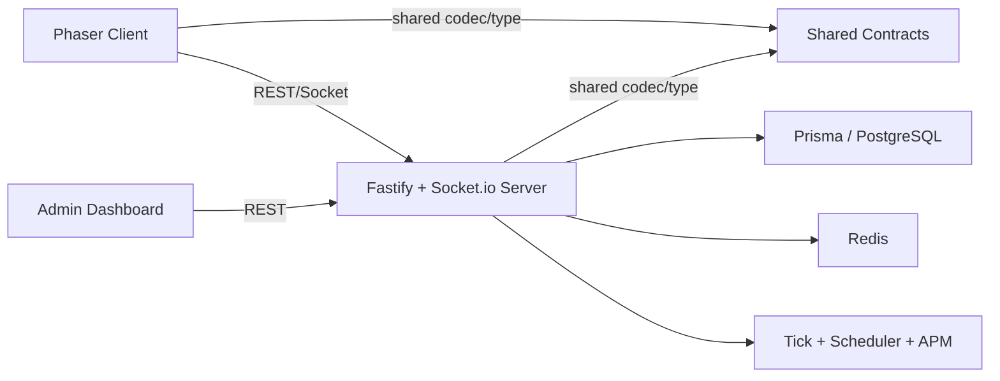

# 웹 아키텍처 분석 리포트

작성일: 2026-03-12

## 요약

- 이 저장소는 `client`, `server`, `admin-dashboard`, `shared`가 느슨한 모노리포 형태로 공존하는 구조이며, 루트 `package.json`은 워크스페이스 관리자라기보다 테스트와 시드 스크립트 실행기 역할에 가깝다.
- 앱 분리는 물리적으로 명확하지만, 서버 부트스트랩과 런타임 오케스트레이션이 `server/src/server.ts`에 집중되어 있어 기능 추가 시 결합도가 빠르게 상승하는 형태다.
- `shared`는 Socket Protobuf 코덱과 텔레메트리 타입이라는 핵심 경계를 제공하지만, REST DTO와 관리자 대시보드 계약까지 포괄하지 못해 경계 계층으로는 아직 얇다.
- 가장 큰 구조 리스크는 서버 초기화 집중, 관리자 대시보드와 서버 간 경로/DTO 불일치, 그리고 `shared` 계약의 단일 출처 부족이다.

## 분석 범위와 근거

- 범위: 웹 스택만 포함한다. `client`, `server`, `admin-dashboard`, `shared`, `tests`, 루트 설정을 기준으로 분석했다.
- 제외: UE5, Unity, UI Toolkit, 인프라 매니페스트 상세 구현, Git 이력 기반 분석
- 핵심 근거:
  - 클라이언트 엔트리: `client/src/main.ts`
  - 서버 엔트리: `server/src/server.ts`
  - 관리자 엔트리: `admin-dashboard/src/App.tsx`
  - 공유 계약: `shared/codec/gameCodec.ts`, `shared/proto/game.proto`, `shared/types/telemetry.ts`

## 현재 시스템 지도

| 영역 | 현재 역할 | 진입점/구조 | 핵심 의존성 | 관찰 |
| --- | --- | --- | --- | --- |
| `client` | Phaser 기반 게임 클라이언트 | 단일 `main.ts`에서 씬 목록을 등록하고 `SceneManager`로 전환 제어 | Phaser, socket.io-client, shared codec/type | 씬 중심 구조는 명확하지만 실제 게임 흐름은 `GameScene`에 집중된다. |
| `server` | Fastify REST + Socket.io + 게임 런타임 오케스트레이션 | `server.ts`에서 40개 라우트, 다수 소켓 핸들러, tick/scheduler, Redis/Prisma/APM 초기화 | Fastify, Prisma, Redis, Socket.io | 구성 루트가 매우 비대하고 인프라/도메인/운영 책임이 섞여 있다. |
| `admin-dashboard` | React 기반 운영 도구 SPA | `App.tsx`에 라우팅 집중, 5개 페이지가 직접 API 호출 | React, axios, Chart.js | 구조는 단순하지만 API 계약과 인증 헤더 처리가 페이지 단위로 흩어져 있다. |
| `shared` | 클라이언트/서버 간 일부 계약 공유 | codec 1개, proto 1개, telemetry type 1개 | protobufjs, TS types | 실시간 통신 경계에는 유용하지만 전체 웹 계약의 SSOT로는 부족하다. |
| `tests` | 서버/게임 계층 검증 | `unit` 11개, `integration` 6개, `e2e` 21개 | Vitest | 서버 도메인과 API는 폭넓게 보지만 관리자 대시보드 검증은 빠져 있다. |

## 런타임 흐름

### 앱 구성

- 클라이언트는 11개 씬을 등록하고 시작점은 단순하다. `SceneManager`가 전환 상태를 관리하고, 개별 씬이 게임 경험을 담당한다.
- 서버는 기능 모듈 수가 많다. `routes`만 40개이며, 소켓 핸들러와 도메인 매니저, 스케줄러, 운영 훅이 모두 부트스트랩에서 조립된다.
- 관리자 대시보드는 5개 페이지로 작지만 서버 운영/분석 기능을 직접 노출한다.
- `shared`는 양쪽을 잇는 계약 계층이지만, 실제 사용 범위는 Socket codec과 대화 텔레메트리에 한정된다.

### 구조적 강점

- 물리적 경계가 선명하다. 게임 클라이언트, 서버, 운영 UI, 공유 계약이 폴더 기준으로 명확히 분리돼 있다.
- 서버는 기능별 라우트와 소켓 핸들러를 분리해 두어, 코드 탐색 자체는 비교적 수월하다.
- `shared` 텔레메트리 타입과 game codec 덕분에 최소한의 교차 계약은 코드 수준에서 재사용된다.
- 테스트가 서버 도메인과 API 흐름을 넓게 덮고 있어, 리팩터링 시 안전망으로 활용할 기반은 있다.

## 영역별 분석

### 1. 게임 클라이언트

#### 현재 구조

- `client/src/main.ts`는 씬 등록과 공통 매니저 초기화만 담당한다.
- `SceneManager`는 전환, 스택, 페이드 제어를 전담해 씬 네비게이션 관심사를 한곳에 모은다.
- 반면 `GameScene`은 월드 생성, 입력 처리, HUD, 네트워크, 이펙트, 사운드, 텔레메트리까지 함께 다룬다.

#### 해석

- 엔트리 구조는 깔끔하지만 실제 게임 코어 흐름은 씬 하나에 통합되어 있다.
- 이 구조는 초기 개발 속도에는 유리하지만, 전투 규칙 변경이나 HUD 변경, 네트워크 변경이 같은 파일에서 충돌할 가능성을 높인다.
- `shared` 사용도 `gameCodec`과 `DialogueChoiceTelemetryEvent` 정도에 머물러 있어, 실시간 통신 외 계약은 로컬 타입에 갇혀 있다.

#### 구조적 위험

- `GameScene`이 프레젠테이션, 입력, 네트워크, 텔레메트리를 동시에 품고 있어 변경 영향 범위가 넓다.
- 네트워크 처리와 HUD 이벤트가 씬 내부 이벤트로 직접 결합돼 있어 재사용이나 테스트 대역 주입이 어렵다.
- shared 계약이 씬 전반 DTO까지 확장되지 않아 서버와의 상태 표현이 점차 분기될 여지가 있다.

### 2. 서버

#### 현재 구조

- `server/src/server.ts`는 CORS, 보안 훅, health endpoint, 40개 라우트 등록, Socket.io 바인딩, APM, Redis, tick manager, spawn manager, quest reset, 이벤트/제재/메일 정리 타이머, graceful shutdown까지 전부 담당한다.
- `db.ts`, `redis.ts`, `tickManager.ts`는 싱글턴 기반 인프라로 구성되어 있다.
- 실시간 통신은 `socketHandler.ts`와 PvP/길드/레이드/소셜/던전/매치메이킹 등 다수의 별도 핸들러로 분리되어 있다.

#### 해석

- 기능 모듈 분리는 존재하지만, 조립 계층이 거대해져 서버 전체의 합성 규칙이 한 파일에 고착되어 있다.
- 서버는 REST API 서버이면서 실시간 게임 런타임이자 운영성 플랫폼 역할까지 동시에 맡고 있다.
- 이 형태는 기능 탐색에는 유리하지만, 테스트 대체, 선택적 부트, 환경별 조합, 기능 토글에는 불리하다.

#### 구조적 강점

- 라우트/핸들러 자체는 도메인 이름으로 잘 쪼개져 있어 관심사 구분이 완전히 무너지지는 않았다.
- Redis 연결 실패를 허용하는 graceful degradation, tick metrics, shutdown 루틴 등 운영 고려가 들어가 있다.
- Socket protobuf 경로는 `shared` 코덱을 재사용해 JSON fallback까지 제공한다.

#### 구조적 위험

- 부트스트랩 과밀: 서버 시작 코드가 인프라 설정, 보안, 도메인 초기화, 스케줄링, 운영 훅을 모두 포함한다.
- 전역 상태 패턴: Redis, Prisma, matchmaker, tick manager, prune timer, spawn manager 등 싱글턴이 많아 테스트 격리와 부분 교체가 어렵다.
- 운영 기능 결합: APM, ops alert, 이벤트 sync, sanction expiry, mail purge 등 운영 로직이 도메인 조립과 같은 레벨에서 엮인다.
- 불완전한 합성 신호: `adminRoutes.ts`의 `setAdminSocketIo()`는 정의돼 있지만 실제 서버 부트스트랩에서 호출되지 않아 `concurrentUsers`가 항상 0으로 남을 가능성이 높다.

### 3. 관리자 대시보드

#### 현재 구조

- `App.tsx`가 라우터와 레이아웃을 정의하고, 각 페이지는 `axios`로 직접 API를 호출한다.
- `DashboardPage`, `EconomyPage`, `UsersPage`, `ReportsPage`, `AnnouncementsPage` 모두 `API_BASE`와 `authHeaders()`를 개별적으로 사용한다.
- 대시보드 계층에는 공통 API 클라이언트, DTO 공유 타입, 에러 처리 표준화 계층이 없다.

#### 해석

- 페이지 수가 적은 지금은 단순하고 빠르지만, 운영 기능이 늘어날수록 같은 인증/요청/오류 처리 코드가 반복될 구조다.
- 프런트가 서버 응답 형상을 자체 가정하는 패턴이 많아 계약 드리프트에 취약하다.

#### 구조적 위험

- 경로 규칙 불일치:
  - 대시보드 기본 `API_BASE`는 `/api`를 포함한다.
  - `ReportsPage`는 `/api/admin/...` 계열과 맞아떨어지지만,
  - `UsersPage`, `AnnouncementsPage`는 `${API_BASE}/admin/...`를 사용해 `/api/admin/...`로 호출하는 반면 서버 `adminRoutes.ts`는 `/admin/...`로 등록한다.
  - 현재 구조만 놓고 보면 관리자 기능 일부는 기본 설정에서 잘못된 URL을 호출할 가능성이 높다.
- DTO 불일치:
  - `UsersPage`는 `nickname`, `level`, `lastLoginAt`를 기대하지만, `adminRoutes.ts`의 `/admin/users` 응답은 `email`, `role`, `isBanned`, `bannedAt`, `banReason`, `createdAt` 중심이다.
  - 이는 화면 렌더링 단계에서 빈 값 또는 오동작으로 이어질 수 있는 구조적 계약 불일치다.
- 인증 처리 중복:
  - 각 페이지가 로컬스토리지에서 토큰을 읽고 헤더를 직접 구성해, 정책 변경 시 수정 지점이 많다.

### 4. 공유 계약 계층

#### 현재 구조

- `shared/proto/game.proto`는 Protobuf 스키마를 정의한다.
- `shared/codec/gameCodec.ts`는 같은 스키마를 문자열 상수 `PROTO_DEFINITION`으로 다시 적어 파싱한다.
- `shared/types/telemetry.ts`는 대화 선택 텔레메트리 이벤트 계약을 제공한다.

#### 해석

- shared 계층 자체는 좋은 방향이다. 문제는 범위와 출처다.
- 현재 코덱 구현은 `.proto` 파일과 문자열 상수를 이중 관리하므로, 장기적으로 계약 드리프트 위험이 있다.
- 관리자 대시보드가 shared를 사용하지 않으므로, 웹 시스템 전체 관점의 계약 계층이라기보다 "일부 소켓 계약 저장소"에 가깝다.

#### 구조적 위험

- single source of truth 부재: `.proto`와 문자열 스키마가 동시에 존재한다.
- 적용 범위 제한: REST 응답/요청 DTO가 shared로 올라오지 않아 프런트와 서버가 독립 추론을 한다.
- 검증 공백: shared 계약 변경이 각 소비자 앱에 미치는 영향에 대한 자동 검증이 없다.

## 테스트 구조와 검증 가능성

### 현재 커버리지 분포

- 단위 테스트 11개:
  - 경제, 인벤토리, 퀘스트, 스킬, 펫, 몬스터 AI, 던전, 체력 해석 등 서버 도메인 로직 중심
- 통합 테스트 6개:
  - 인증, 전투, 길드 레이드, 퀘스트, 상점/제작, 소셜/채팅 흐름
- E2E 테스트 21개:
  - 관리자, 분석, 경매장, 인증, 도감, 제작, 던전, 경제, 길드, 인벤토리, 몬스터, 알림, NPC, 펫, PvP, 퀘스트, 랭킹, 시즌2, 스킬, 소셜, 튜토리얼

### 해석

- 테스트 무게중심은 서버 기능과 게임 기능에 있다.
- 루트 Vitest 커버리지 include는 `server/src`, `client/src`, `shared`만 포함하고 있어 `admin-dashboard`는 커버리지 체계에서 제외된다.
- 즉, 관리자 대시보드는 운영상 중요한 앱임에도 현재 검증 체계의 바깥에 있다.

## 우선순위별 개선안

### 1순위: 구조 병목과 운영 리스크 제거

- 서버 부트스트랩 분리:
  - `server.ts`를 composition root, feature registration, runtime services, shutdown wiring로 나눈다.
  - 기능별 등록을 선언형 manifest로 정리해 조립 규칙을 한눈에 보이게 만든다.
- 관리자 API 계약 정상화:
  - `/admin/*`와 `/api/admin/*`를 하나로 통일한다.
  - 관리자 페이지 응답 DTO를 서버와 공유 타입으로 고정한다.
  - `UsersPage`와 서버 응답 형상 불일치를 해소한다.
- admin socket wiring 보완:
  - `setAdminSocketIo()`를 실제 부트스트랩에서 연결하거나, 사용하지 않을 것이라면 제거해 잘못된 지표를 막는다.
- shared 계약 SSOT 정리:
  - `.proto` 파일을 단일 출처로 삼고 코덱이 이를 참조하도록 바꾼다.

### 2순위: 유지보수성과 확장성 개선

- 클라이언트 씬 분해:
  - `GameScene`에서 네트워크, HUD orchestration, telemetry emission, combat effect orchestration을 서비스 또는 어댑터로 추출한다.
- 관리자 API 레이어 도입:
  - `axios` 인스턴스, 인증 인터셉터, 에러 매핑, DTO 검증을 공통화한다.
- 서버 인프라 접근 규칙 정리:
  - Prisma/Redis/timer 싱글턴 직접 참조 대신 명시적 컨텍스트 또는 service container 경유 규칙을 도입한다.

### 3순위: 문서화와 테스트 보강

- 웹 구조 문서를 지속 가능한 형태로 유지:
  - 앱별 책임, 계약 경계, 런타임 흐름을 README 또는 docs index와 연결한다.
- 계약 검증 테스트 추가:
  - 관리자 대시보드와 서버 간 경로/DTO 일치 여부를 검증하는 계약 테스트를 도입한다.
- 관리자 대시보드 테스트 편입:
  - 최소한 API mocking 기반 페이지 렌더링/상호작용 테스트를 추가한다.
- shared 변경 감지 자동화:
  - codec/proto/type 변경 시 클라이언트/서버 소비자 테스트가 함께 실행되도록 CI를 묶는다.

## 결론

- 이 저장소의 가장 큰 장점은 역할별 물리적 분리와 풍부한 서버 기능 모듈, 그리고 일부 공유 계약의 존재다.
- 반대로 가장 큰 약점은 "조립 규칙이 서버 엔트리에 과하게 몰린 구조"와 "웹 앱 간 계약이 부분적으로만 공유되는 구조"다.
- 따라서 다음 단계의 핵심은 기능 추가보다 먼저 조립 계층과 계약 계층을 정돈하는 것이다.
- 특히 서버 부트스트랩 분해, 관리자 API 정상화, shared SSOT 정리는 전체 웹 시스템의 복잡도를 가장 많이 낮출 수 있는 투자다.
